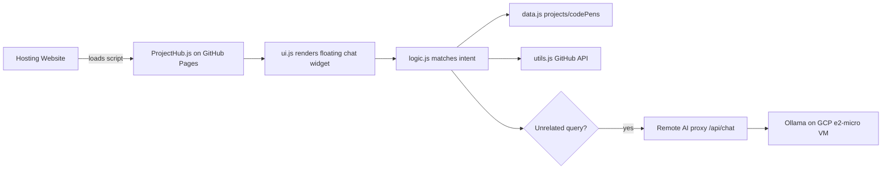

# architecture-overview.md

**Read when:** You need to understand how ProjectHub is structured, how data flows, or how the backend migration to Ollama on GCP works.

---

## High-Level System

---

## Components

| Component | Responsibility |
|-----------|----------------|
| `ProjectHub.js` | Entry point. Embeds the data, logic, utils, and UI as IIFE modules for single-file CDN consumption. |
| `data.js` | Canonical project, CodePen, and suggestion arrays. |
| `logic.js` | Intent detection, response generation, conversation history, AI fallback trigger. |
| `ui.js` | Chat DOM creation, event handling, styling, loading spinner. |
| `utils.js` | GitHub repo metadata fetcher. |
| Remote proxy | Provides general AI responses when local intent handlers cannot answer. |
| Ollama backend | Future zero-cost LLM backend running on GCP Compute Engine. |

---

## Data Flow

1. User loads a site that embeds `https://bradleymatera.github.io/ProjectHub/ProjectHub.js`.
2. `ProjectHub.js` initializes:
   - defines `projects`, `codePens`, `suggestions`
   - defines `fetchGitHubRepoData`, `fetchAllGitHubData`
   - defines `handleQuery`
   - calls `setupChatUI(...)`
3. User types a query.
4. `ui.js` calls `handleQuery(userQuery, projects, codePens, lastQueryTopic, fetchAllGitHubData)`.
5. `logic.js` tries exact/intent matches:
   - Bradley bio, GitHub, LinkedIn
   - project by name
   - CodePen by name
   - platform, tech, list, compare, most stars
6. If no match and the query is unrelated, it calls the remote `/api/chat` proxy.
7. The proxy forwards to an LLM (currently Heroku; migrating to Ollama on GCP).

---

## Backend Migration (In Progress)

The goal is to replace the paid Heroku AI proxy with a **zero-cost** Ollama backend on Google Cloud’s Always Free tier.

See `backend-guide.md` for the full deployment plan.

### Key decisions

- **VM:** `e2-micro` in `us-west1`, `us-central1`, or `us-east1`
- **Disk:** 30 GB standard persistent disk (Always Free)
- **Model:** small quantized open-source model (e.g., Mistral 7B Q4_K_M or smaller)
- **Proxy:** small Node.js/Express server on port 8080 forwarding to `localhost:11434/v1/chat/completions`
- **Security:** firewall rules, CORS to the allowed domain, API key, HTTPS via managed cert or Let’s Encrypt
- **Storage:** optional Firestore Native mode for chat history within free quota

---

## Constraints

- No build step / no bundler.
- Must remain embeddable via one `<script>` tag.
- Files should stay readable in the browser without transpilation.
- Backend must fit within GCP Always Free limits.
