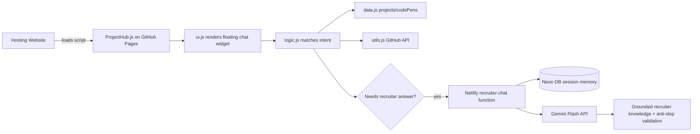

# architecture-overview.md

**Read when:** You need to understand how ProjectHub is structured, how data flows, or how the backend AI integration works.

---

## High-Level System

---

## Components

| Component | Responsibility |
|-----------|----------------|
| `ProjectHub.js` | Entry point. Embeds the data, logic, utils, and UI as IIFE modules for single-file CDN consumption. |
| `data.js` | Canonical project, CodePen, and suggestion arrays. |
| `logic.js` | Intent detection, response generation, conversation history, AI fallback trigger. |
| `ui.js` | Chat DOM creation, event handling, styling, loading spinner. |
| `utils.js` | GitHub repo metadata fetcher. |
| Netlify recruiter-chat | Gemini Flash-powered function. Fetches knowledge base, builds grounded prompts, validates anti-slop, stores session memory in Neon DB. |
| Session memory | Per-tab conversation history persisted in Neon PostgreSQL with fallback to function memory. |
| Recruiter knowledge | `data/recruiter-knowledge.json` hosted on GitHub — cached 5 minutes by the function. |

---

## Data Flow

1. User loads a site that embeds `https://bradleymatera.github.io/ProjectHub/ProjectHub.js`.
2. `ProjectHub.js` initializes:
   - defines `projects`, `codePens`, `suggestions`
   - defines `fetchGitHubRepoData`, `fetchAllGitHubData`
   - defines `handleQuery`
   - calls `setupChatUI(...)`
3. User types a query.
4. `ui.js` calls `handleQuery(userQuery, projects, codePens, lastQueryTopic, fetchAllGitHubData, chatSession)` with a per-tab session id and recent turn context.
5. `logic.js` tries exact/intent matches:
   - Bradley bio, GitHub, LinkedIn
   - project by name
   - CodePen by name
   - platform, tech, list, compare, most stars
6. If the query needs a recruiter-style answer, it calls `/.netlify/functions/recruiter-chat` on `bradleymatera.dev`.
7. The Netlify function fetches `data/recruiter-knowledge.json` from GitHub (cached 5 minutes), reads session memory from Neon DB, builds a grounded prompt including conversation history, calls Gemini Flash, validates the reply against anti-slop rules, stores the updated memory, and returns the answer.

---

## Backend Runtime

The backend lives in the **gatsbyblog** repo (portfolio site), not in this ProjectHub repo.

- **Function:** `netlify/functions/recruiter-chat.js` — calls Gemini Flash with grounded prompts
- **Knowledge base:** `data/recruiter-knowledge.json` in this repo, fetched raw from GitHub
- **Session memory:** Neon PostgreSQL via `@neondatabase/serverless`, table `projecthub_chat_sessions`
- **Cost:** Gemini Flash free tier (1,500 requests/day) + Netlify Pro (already paid)

See the gatsbyblog repo for deployment code and Netlify configuration.

---

## Constraints

- No build step / no bundler.
- Must remain embeddable via one `<script>` tag.
- Files should stay readable in the browser without transpilation.
- Backend must fit within GCP Always Free limits.
