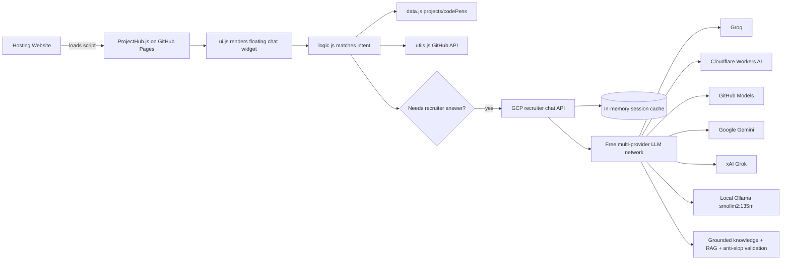

# architecture-overview.md

**Read when:** You need to understand how ProjectHub is structured, how data flows, or how the backend AI integration works.

---

## High-Level System

---

## Components

| Component | Responsibility |
|-----------|----------------|
| `ProjectHub.js` | Entry point. Embeds the data, logic, utils, and UI as IIFE modules for single-file CDN consumption. |
| `data.js` | Canonical project, CodePen, and suggestion arrays. |
| `logic.js` | Intent detection, response generation, conversation history, AI fallback trigger. |
| `ui.js` | Chat DOM creation, event handling, styling, loading spinner. |
| `utils.js` | GitHub repo metadata fetcher. |
| GCP recruiter chat API | `server-gemini.js` running on a GCP e2-micro VM free tier with Caddy HTTPS. Routes open-ended questions through a free multi-provider LLM network (Groq, Cloudflare Workers AI, GitHub Models, Gemini, xAI Grok) with local Ollama (`smollm2:135m`) as the final fallback. Fetches the knowledge base, validates replies, and caches session memory in process. Includes Think Mode self-improvement loop and safety/false-claim regexes. |
| Session memory | Per-tab session id with last 3 turns cached in process. Frontend keeps 10 turns and sends 5 to the server. |
| Recruiter knowledge | `data/recruiter-knowledge.json` hosted raw on GitHub — includes canonical facts plus `sourceMaterial` chunks. |

---

## Data Flow

1. User loads a site that embeds `https://bradleymatera.github.io/ProjectHub/ProjectHub.js`.
2. `ProjectHub.js` initializes:
   - defines `projects`, `codePens`, `suggestions`
   - defines `fetchGitHubRepoData`, `fetchAllGitHubData`
   - defines `handleQuery`
   - calls `setupChatUI(...)`
3. User types a query.
4. `ui.js` calls `handleQuery(userQuery, projects, codePens, lastQueryTopic, fetchAllGitHubData, chatSession)` with a per-tab session id and recent turn context.
5. `logic.js` tries exact/intent matches:
   - Bradley bio, GitHub, LinkedIn
   - project by name
   - CodePen by name
   - platform, tech, list, compare, most stars
6. If the query needs a recruiter-style answer, it calls `https://projecthub-chat.bradleymatera.dev/api/chat`.
7. The API fetches `data/recruiter-knowledge.json` from GitHub (cached in memory), runs safety and false-claim checks first, then checks learned answers, then builds a grounded fallback. For open-ended questions, it walks the free provider network in priority order. Each provider receives a RAG prompt built from the grounded context. Replies are validated against anti-slop/false-claim rules. If no provider succeeds, the grounded answer is returned. The last 3 turns per session are kept in memory.

---

## Backend Runtime

The backend lives in this repo as `server-gemini.js` and is deployed to a GCP VM.

- **Server:** `server-gemini.js` — Express API that serves the widget endpoint and routes LLM calls through the free provider network.
- **Generative layer:** Free multi-provider LLM network (Groq, Cloudflare Workers AI, GitHub Models, Google Gemini, xAI Grok) with local Ollama (`smollm2:135m`) as the final fallback.
- **Think Mode:** Self-improvement loop runs every 10 minutes. Stashes weak answers, processes through all LLM providers, validates, and pushes learned answers back to GitHub. False-claim and safety questions are filtered before stashing.
- **Safety system:** Safety regex blocks injection/XSS/social engineering. False-claim regex blocks exaggerated claims. Both run BEFORE learned answers in `buildGroundedFallbackPayload`.
- **Knowledge base:** `data/recruiter-knowledge.json` in this repo, fetched raw from GitHub. Includes canonical facts, `learnedAnswers` (pushed by Think Mode), and `sourceMaterial` chunks ingested by `scripts/build-knowledge.js`.
- **Session memory:** In-memory process cache of the last 3 turns per session.
- **Cost:** GCP Always Free e2-micro VM + free LLM tiers + local Ollama. No paid LLM credits are required.
- **Agent:** The assistant is named **Scout** and uses the persona in `knowledge.agent`.
- **Test suites:** 6 test suites (adversarial, coverage, load/stress, regression, edge cases, verification) — 474+ tests total, 99.8% pass rate.

---

## Constraints

- No build step / no bundler.
- Must remain embeddable via one `<script>` tag.
- Files should stay readable in the browser without transpilation.
- Backend must fit within GCP Always Free limits.
- AI layer must remain free — free provider tiers and local Ollama only.
