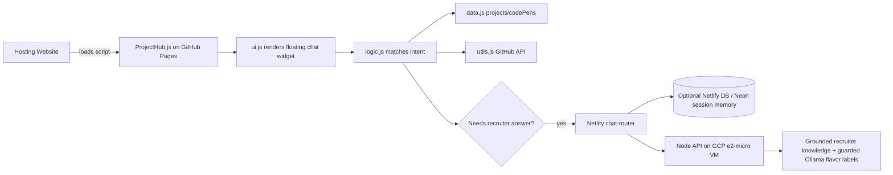

# architecture-overview.md

**Read when:** You need to understand how ProjectHub is structured, how data flows, or how the backend migration to Ollama on GCP works.

---

## High-Level System

---

## Components

| Component | Responsibility |
|-----------|----------------|
| `ProjectHub.js` | Entry point. Embeds the data, logic, utils, and UI as IIFE modules for single-file CDN consumption. |
| `data.js` | Canonical project, CodePen, and suggestion arrays. |
| `logic.js` | Intent detection, response generation, conversation history, AI fallback trigger. |
| `ui.js` | Chat DOM creation, event handling, styling, loading spinner. |
| `utils.js` | GitHub repo metadata fetcher. |
| Netlify chat router | Classifies, caches, forwards requests, and stores session memory when Netlify DB/Neon is configured. |
| Recruiter chat API | Provides grounded recruiter-safe answers when local intent handlers cannot answer naturally. |
| Ollama backend | Zero-cost local model running privately on GCP Compute Engine for guarded 3-5 word flavor labels and low-risk wording. |

---

## Data Flow

1. User loads a site that embeds `https://bradleymatera.github.io/ProjectHub/ProjectHub.js`.
2. `ProjectHub.js` initializes:
   - defines `projects`, `codePens`, `suggestions`
   - defines `fetchGitHubRepoData`, `fetchAllGitHubData`
   - defines `handleQuery`
   - calls `setupChatUI(...)`
3. User types a query.
4. `ui.js` calls `handleQuery(userQuery, projects, codePens, lastQueryTopic, fetchAllGitHubData, chatSession)` with a per-tab session id and recent turn context.
5. `logic.js` tries exact/intent matches:
   - Bradley bio, GitHub, LinkedIn
   - project by name
   - CodePen by name
   - platform, tech, list, compare, most stars
6. If the query needs a recruiter-style answer, it calls `/.netlify/functions/chat-router` on `bradleymatera.dev`, or the GCP API directly elsewhere.
7. The Netlify router persists trimmed session memory in Neon/Netlify DB when configured, otherwise in memory, and forwards the request to the GCP API.
8. The API fetches `data/recruiter-knowledge.json`, returns deterministic grounded answers for factual topics, and uses Ollama only for guarded tiny flavor labels or low-risk output that passes validation.

---

## Backend Runtime

The paid Heroku proxy has been replaced with a **zero-cost** Ollama-backed API on Google Cloud’s Always Free tier.

See `backend-guide.md` for the full deployment plan.

### Key decisions

- **VM:** `e2-micro` in `us-west1`, `us-central1`, or `us-east1`
- **Disk:** 30 GB standard persistent disk (Always Free)
- **Model:** `smollm2:135m` for guarded low-risk generation on micro hardware
- **Proxy:** Node.js/Express server on `127.0.0.1:3000`, reverse proxied by Caddy
- **Security:** CORS to allowed domains, HTTPS via Caddy/Let’s Encrypt, Ollama bound to localhost
- **Storage:** optional Firestore Native mode for chat history within free quota

---

## Constraints

- No build step / no bundler.
- Must remain embeddable via one `<script>` tag.
- Files should stay readable in the browser without transpilation.
- Backend must fit within GCP Always Free limits.
