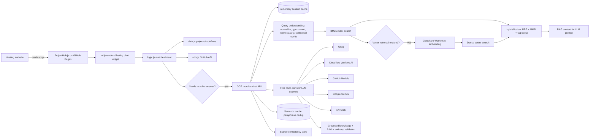

# architecture-overview.md

**Read when:** You need to understand how ProjectHub is structured, how data flows, or how the backend AI integration works.

---

## High-Level System

---

## Components

| Component | Responsibility |
|-----------|----------------|
| `ProjectHub.js` | Entry point. Embeds the data, logic, utils, and UI as IIFE modules for single-file CDN consumption. |
| `data.js` | Canonical project, CodePen, and suggestion arrays. |
| `logic.js` | Intent detection, response generation, conversation history, AI fallback trigger. |
| `ui.js` | Chat DOM creation, event handling, styling, loading spinner. |
| `utils.js` | GitHub repo metadata fetcher. |
| GCP recruiter chat API | `server-gemini.js` running on a GCP e2-micro VM free tier with Caddy HTTPS. Routes open-ended questions through a free multi-provider LLM network (Groq, Cloudflare Workers AI, GitHub Models, Gemini, xAI Grok). If every provider is unavailable or the reply fails validation, the final fallback is a fast, grounded answer from `data/recruiter-knowledge.json`. Fetches the knowledge base, validates replies, and caches session memory in process. Includes Think Mode self-improvement loop, safety/false-claim regexes, hybrid BM25+dense retrieval, stance consistency store, and semantic cache. |
| Retrieval pipeline | `lib/rag-chunks.js` flattens knowledge into ~600 retrievable chunks. `lib/bm25.js` provides Okapi BM25 scoring (TF saturation, IDF, length normalization). `lib/query-understanding.js` normalizes queries, corrects typos, classifies intent, and rewrites follow-ups with context. `lib/vector-index.js` loads pre-built Cloudflare Workers AI embeddings for dense retrieval. `lib/hybrid-retrieve.js` fuses BM25 + dense results via reciprocal rank fusion (RRF) + maximal marginal relevance (MMR). |
| Stance consistency | Per-session topic stances stored in memory. After each reply, the first sentence is recorded per topic. On subsequent turns, prior stances are injected into the LLM prompt to prevent contradictions. 30-min TTL, cap 8 per session. |
| Semantic cache | Paraphrase dedup via embedding cosine similarity (≥0.92 threshold). LRU, 200 entries, 10-min TTL. Only active when vector retrieval is enabled. Saves redundant embedding + retrieval + LLM calls. |
| Session memory | Per-tab session id with last 3 turns cached in process. Frontend keeps 10 turns and sends 5 to the server. |
| Recruiter knowledge | `data/recruiter-knowledge.json` hosted raw on GitHub — includes canonical facts plus `sourceMaterial` chunks. |

---

## Data Flow

1. User loads a site that embeds `https://bradleymatera.github.io/ProjectHub/ProjectHub.js`.
2. `ProjectHub.js` initializes:
   - defines `projects`, `codePens`, `suggestions`
   - defines `fetchGitHubRepoData`, `fetchAllGitHubData`
   - defines `handleQuery`
   - calls `setupChatUI(...)`
3. User types a query.
4. `ui.js` calls `handleQuery(userQuery, projects, codePens, lastQueryTopic, fetchAllGitHubData, chatSession)` with a per-tab session id and recent turn context.
5. `logic.js` tries exact/intent matches:
   - Bradley bio, GitHub, LinkedIn
   - project by name
   - CodePen by name
   - platform, tech, list, compare, most stars
6. If the query needs a recruiter-style answer, it calls `https://projecthub-chat.bradleymatera.dev/api/chat`.
7. The API fetches `data/recruiter-knowledge.json` from GitHub (cached in memory), builds the BM25 index and RAG chunks, runs safety and false-claim checks first, then checks learned answers, then builds a grounded fallback. For open-ended questions, the retrieval pipeline runs: query understanding (normalize, typo correct, intent classify, contextual rewrite) → BM25 search → optional dense vector search → hybrid fusion (RRF + MMR). The fused context is used to build the RAG prompt. The API then walks the free provider network in priority order. Each provider receives the RAG prompt built from the retrieved context. Replies are validated against anti-slop/false-claim rules. If no provider succeeds, the grounded answer is returned. The last 3 turns per session are kept in memory. Stance context from prior turns is injected into the prompt to ensure consistency.

---

## Backend Runtime

The backend lives in this repo as `server-gemini.js` and is deployed to a GCP VM.

- **Server:** `server-gemini.js` — Express API that serves the widget endpoint and routes LLM calls through the free provider network.
- **Generative layer:** Free multi-provider LLM network (Groq, Cloudflare Workers AI, GitHub Models, Google Gemini, xAI Grok). If every provider is unavailable or the reply fails validation, the final fallback is a fast, grounded answer from `data/recruiter-knowledge.json`.
- **Retrieval pipeline:** Okapi BM25 index (`lib/bm25.js`) with query understanding (`lib/query-understanding.js`) is the default retrieval mode. When `USE_VECTOR_RETRIEVAL=true`, dense vector retrieval via Cloudflare Workers AI embeddings (`lib/vector-index.js`) is fused with BM25 via reciprocal rank fusion + MMR (`lib/hybrid-retrieve.js`). BM25 Recall@6=0.950 on 40-query golden eval set.
- **Stance consistency:** Per-session topic stances injected into LLM prompts to prevent contradictions across turns.
- **Semantic cache:** Paraphrase dedup via embedding cosine similarity (≥0.92), LRU 200 entries, 30-min TTL.
- **Think Mode:** Self-improvement loop runs every 20 minutes. Stashes weak answers, processes up to 3 per cycle through all LLM providers, validates, and pushes learned answers back to GitHub. False-claim, safety, out-of-scope, and meta questions are filtered before stashing. Auto-triggers on provider recovery.
- **Safety system:** Safety regex blocks injection/XSS/social engineering. False-claim regex blocks exaggerated claims. Both run BEFORE learned answers in `buildGroundedFallbackPayload`.
- **Knowledge base:** `data/recruiter-knowledge.json` in this repo, fetched raw from GitHub. Includes canonical facts, `learnedAnswers` (pushed by Think Mode), and `sourceMaterial` chunks ingested by `scripts/build-knowledge.js`.
- **Session memory:** In-memory process cache of the last 3 turns per session.
- **Cost:** GCP Always Free e2-micro VM + free LLM tiers. No paid LLM credits are required.
- **Agent:** The assistant is named **Scout** and uses the persona in `knowledge.agent`.
- **Test suites:** 6 test suites (adversarial, coverage, load/stress, regression, edge cases, verification) — 474+ tests total, 99.8% pass rate. Plus 2 quality suites (real conversation replay with 40 visitor questions, quality regression with 60+ targeted tests) and 36 retrieval unit tests (BM25, query understanding, vector index, hybrid fusion) and 40-query golden eval.

---

## Constraints

- No build step / no bundler.
- Must remain embeddable via one `<script>` tag.
- Files should stay readable in the browser without transpilation.
- Backend must fit within GCP Always Free limits.
- AI layer must remain free — free provider tiers only, with grounded knowledge as the final fallback.
