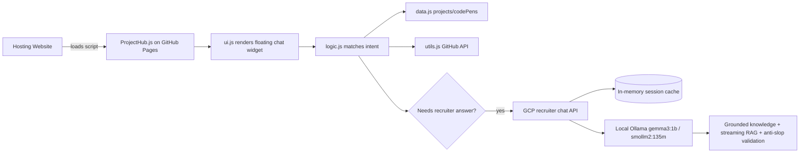

# architecture-overview.md

**Read when:** You need to understand how ProjectHub is structured, how data flows, or how the backend AI integration works.

---

## High-Level System

---

## Components

| Component | Responsibility |
|-----------|----------------|
| `ProjectHub.js` | Entry point. Embeds the data, logic, utils, and UI as IIFE modules for single-file CDN consumption. |
| `data.js` | Canonical project, CodePen, and suggestion arrays. |
| `logic.js` | Intent detection, response generation, conversation history, AI fallback trigger. |
| `ui.js` | Chat DOM creation, event handling, styling, loading spinner. |
| `utils.js` | GitHub repo metadata fetcher. |
| GCP recruiter chat API | `server-gemini.js` running on a GCP VM. Uses local Ollama (`gemma3:1b` fallback + `smollm2:135m` generative RAG), fetches knowledge base, validates anti-slop, and caches session memory in process. |
| Session memory | Per-tab session id with last 3 turns cached in process. |
| Recruiter knowledge | `data/recruiter-knowledge.json` hosted raw on GitHub — includes canonical facts plus `sourceMaterial` chunks. |

---

## Data Flow

1. User loads a site that embeds `https://bradleymatera.github.io/ProjectHub/ProjectHub.js`.
2. `ProjectHub.js` initializes:
   - defines `projects`, `codePens`, `suggestions`
   - defines `fetchGitHubRepoData`, `fetchAllGitHubData`
   - defines `handleQuery`
   - calls `setupChatUI(...)`
3. User types a query.
4. `ui.js` calls `handleQuery(userQuery, projects, codePens, lastQueryTopic, fetchAllGitHubData, chatSession)` with a per-tab session id and recent turn context.
5. `logic.js` tries exact/intent matches:
   - Bradley bio, GitHub, LinkedIn
   - project by name
   - CodePen by name
   - platform, tech, list, compare, most stars
6. If the query needs a recruiter-style answer, it calls `https://projecthub-chat.bradleymatera.dev/api/chat`.
7. The API fetches `data/recruiter-knowledge.json` from GitHub (cached in memory), builds a grounded fallback first, retrieves relevant `sourceMaterial` chunks for RAG, streams a rewrite through local Ollama (`smollm2:135m`), aborts on forbidden patterns, validates the generated reply against anti-slop rules, and falls back to the grounded answer if anything fails. It keeps the last 3 turns per session.

---

## Backend Runtime

The backend lives in this repo as `server-gemini.js` and is deployed to a GCP VM.

- **Server:** `server-gemini.js` — Express API that calls local Ollama with grounded prompts and RAG
- **Model:** `gemma3:1b` for fallback chat, `smollm2:135m` for streaming generative RAG
- **Knowledge base:** `data/recruiter-knowledge.json` in this repo, fetched raw from GitHub. Includes canonical facts plus `sourceMaterial` chunks ingested by `scripts/build-knowledge.js`.
- **Session memory:** In-memory process cache of the last 3 turns per session.
- **Cost:** GCP Always Free VM + local Ollama (no paid LLM credits).
- **Agent:** The assistant is named **Jarvis** and uses the persona in `knowledge.agent`.

---

## Constraints

- No build step / no bundler.
- Must remain embeddable via one `<script>` tag.
- Files should stay readable in the browser without transpilation.
- Backend must fit within GCP Always Free limits.
