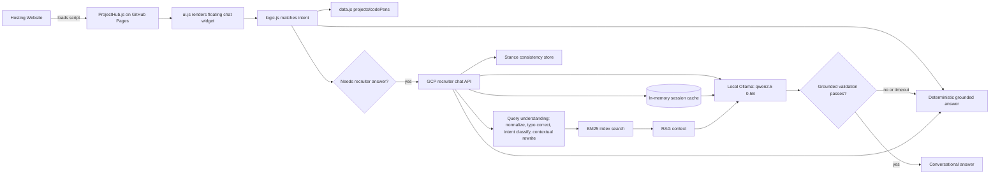

# architecture-overview.md

**Read when:** You need to understand how ProjectHub is structured, how data flows, or how the backend AI integration works.

---

## High-Level System

```mermaid
flowchart LR
    A[Hosting Website] -- loads script --> B[ProjectHub.js on GitHub Pages]
    B --> C[ui.js renders floating chat widget]
    C --> D[logic.js matches intent]
    D --> E[data.js projects/codePens]
    D --> F[utils.js GitHub API]
    D --> G{Needs recruiter answer?}
    G -- yes --> H[GCP recruiter chat API]
    H --> M[(In-memory session cache)]
    H --> R[Query understanding: normalize, typo correct, intent classify, contextual rewrite]
    R --> S[BM25 index search]
    S --> X[RAG context]
    H --> I[Local Ollama: qwen2.5 0.5B]
    M --> I
    X --> I
    I --> V{Grounded validation passes?}
    V -- yes --> K[Conversational answer]
    V -- no or timeout --> F[Deterministic grounded answer]
    H --> F
    H --> ST[Stance consistency store]
```

---

## Components

| Component | Responsibility |
|-----------|----------------|
| `ProjectHub.js` | Entry point. Embeds the data, logic, utils, and UI as IIFE modules for single-file CDN consumption. |
| `data.js` | Canonical project, CodePen, and suggestion arrays. |
| `logic.js` | Intent detection, response generation, conversation history, AI fallback trigger. |
| `ui.js` | Chat DOM creation, event handling, styling, loading spinner. |
| `utils.js` | GitHub repo metadata fetcher. |
| GCP recruiter chat API | `server-gemini.js` runs Node and loopback-only Ollama on an e2-micro VM. Local Qwen phrases open-ended answers; deterministic tools handle evidence-heavy questions. Every generated reply must pass source, entity, number, safety, and overclaim validation. |
| Retrieval pipeline | `lib/rag-chunks.js` flattens knowledge into chunks. `lib/bm25.js` scores them locally. `lib/query-understanding.js` corrects typos, classifies intent, and rewrites contextual follow-ups. |
| Stance consistency | The first answer sentence is recorded per topic and injected into later prompts to prevent contradictions. 60-minute TTL, cap 12 per session. |
| Session memory | The five newest sanitized user/assistant turns are injected into local prompts. The frontend also sends the five latest turns. |
| Recruiter knowledge | Bundled `data/recruiter-knowledge.json`; local-only mode makes no runtime knowledge fetch. |

---

## Data Flow

1. User loads a site that embeds `https://bradleymatera.github.io/ProjectHub/ProjectHub.js`.
2. `ProjectHub.js` initializes:
   - defines `projects`, `codePens`, `suggestions`
   - defines `fetchGitHubRepoData`, `fetchAllGitHubData`
   - defines `handleQuery`
   - calls `setupChatUI(...)`
3. User types a query.
4. `ui.js` calls `handleQuery(userQuery, projects, codePens, lastQueryTopic, fetchAllGitHubData, chatSession)` with a per-tab session id and recent turn context.
5. `logic.js` tries exact/intent matches:
   - Bradley bio, GitHub, LinkedIn
   - project by name
   - CodePen by name
   - platform, tech, list, compare, most stars
6. If the query needs a recruiter-style answer, it calls `https://projecthub-chat.bradleymatera.dev/api/chat`.
7. The API reads bundled `data/recruiter-knowledge.json`, builds the BM25 index, applies safety checks, and computes a deterministic grounded answer first. Open-ended questions add BM25 facts, five recent verified turns, and the prior topic stance to a bounded Qwen prompt. The reply is accepted only when all validators pass; otherwise the ready grounded answer is returned within the same request.

---

## Backend Runtime

The backend lives in this repo as `server-gemini.js` and is deployed to a GCP VM.

- **Server:** `server-gemini.js` — Express API serving local retrieval, local inference, memory, tools, and validation.
- **Generative layer:** Pre-warmed `qwen2.5:0.5b` through loopback-only Ollama, with a 12.5-second model cap and 64-token output limit so the full request stays inside 15 seconds.
- **Retrieval pipeline:** Local Okapi BM25 with query understanding. BM25 Recall@6=1.000 on the current 40-query golden eval set.
- **Stance consistency:** Per-session topic stances injected into LLM prompts to prevent contradictions across turns.
- **Think Mode:** Evaluates weak answers with local Ollama and stores validated improvements in the local learned file; it performs no external writes.
- **Safety system:** Safety regex blocks injection/XSS/social engineering. False-claim regex blocks exaggerated claims. Both run BEFORE learned answers in `buildGroundedFallbackPayload`.
- **Knowledge base:** Bundled `data/recruiter-knowledge.json`, including canonical facts and `sourceMaterial` chunks.
- **Session memory:** Five sanitized turns plus up to 12 topic stances per session.
- **Cost:** GCP Always Free e2-micro VM; no hosted LLM account or AI credits.
- **Agent:** The assistant is named **Scout** and uses the persona in `knowledge.agent`.
- **Test suites:** 6 legacy API suites plus 58 checked-in Node unit tests, a 48-request local API evaluation, and a 40-query BM25 golden eval.

---

## Constraints

- No build step / no bundler.
- Must remain embeddable via one `<script>` tag.
- Files should stay readable in the browser without transpilation.
- Backend must fit within GCP Always Free limits.
- AI layer must remain local-only and free, with grounded knowledge as the final fallback.
