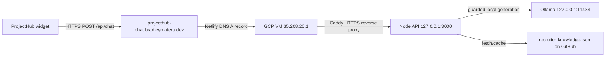

# backend-guide.md

**Read when:** You need to deploy, migrate, or secure the zero-cost Ollama chat backend on Google Cloud.

---

## Goal

Host an Ollama-backed chat API that serves the ProjectHub widget from a free Google Cloud micro VM, replacing the current Heroku proxy.

---

## Always Free Constraints

| Resource | Allowance |
|----------|-----------|
| Compute Engine | 1 `f1-micro` or 1 `e2-micro` instance, up to 720 hours/month |
| Regions | `us-west1`, `us-central1`, `us-east1` |
| Disk | 30 GB standard persistent disk |
| Snapshot | 5 GB |
| Firestore | 1 GiB storage, 50k reads/day, 20k writes/day, 20k deletes/day |
| Same-region egress | Free |

Use an `e2-micro` with standard persistent disk to stay within Always Free.

---

## Architecture



Current production path: Netlify DNS `A` record for `projecthub-chat.bradleymatera.dev` points to the GCP VM external IP `35.208.20.1`. Caddy terminates HTTPS with Let's Encrypt and proxies to the Node API on `127.0.0.1:3000`. Ollama stays private on `127.0.0.1:11434`.

---

## Step-by-Step Deployment

### 1. Create the VM

- Region: `us-west1`, `us-central1`, or `us-east1`
- Machine type: `e2-micro`
- Boot disk: Ubuntu 22.04 LTS, 30 GB standard persistent disk
- Allow HTTP/HTTPS traffic (we will narrow this later)

### 2. Install Ollama

SSH into the VM and run:

```bash
curl -fsSL https://ollama.com/install.sh | sh
sudo systemctl enable --now ollama
```

Ollama will listen on `localhost:11434`.

### 3. Pull a Lightweight Model

Choose a model that fits ~1 GiB RAM on an `e2-micro`. Examples:

```bash
ollama pull mistral:7b-instruct-q4_K_M
ollama pull phi3:mini
ollama pull llama3.2:1b
```

Avoid large models like `gpt-oss:20b`; they will not run on micro hardware.

### 4. Build the Proxy Server

A minimal Node.js/Express proxy:

```javascript
const express = require('express');
const fetch = require('node-fetch');
const cors = require('cors');
const app = express();

const ALLOWED_ORIGINS = ['https://bradleymatera.github.io'];
const API_KEY = process.env.PROJECTHUB_API_KEY;

app.use(cors({
  origin: function (origin, callback) {
    if (!origin || ALLOWED_ORIGINS.includes(origin)) return callback(null, true);
    callback(new Error('Not allowed by CORS'));
  }
}));

app.use(express.json());

app.post('/api/chat', async (req, res) => {
  if (req.headers['x-api-key'] !== API_KEY) {
    return res.status(401).json({ error: 'Unauthorized' });
  }

  const ollamaRes = await fetch('http://localhost:11434/v1/chat/completions', {
    method: 'POST',
    headers: { 'Content-Type': 'application/json' },
    body: JSON.stringify({
      model: 'mistral:7b-instruct-q4_K_M',
      messages: [{ role: 'user', content: req.body.message }]
    })
  });

  const data = await ollamaRes.json();
  res.json({ reply: data.choices?.[0]?.message?.content || 'No response' });
});

app.listen(8080, () => console.log('Proxy listening on port 8080'));
```

### 5. Run the Proxy as a Service

Use `systemd` or `pm2` so the proxy starts on boot and restarts on failure.

Example `systemd` service at `/etc/systemd/system/recruiter-chat-api.service`:

```ini
[Unit]
Description=ProjectHub Recruiter Chat API
After=network.target

[Service]
Type=simple
User=ubuntu
WorkingDirectory=/opt/recruiter-chat-api
ExecStart=/usr/bin/node server.js
Restart=always

[Install]
WantedBy=multi-user.target
```

Then:

```bash
sudo systemctl daemon-reload
sudo systemctl enable --now recruiter-chat-api
```

### 6. Secure the Network

- Create a firewall rule allowing inbound TCP 8080 only from your website’s IP ranges or CDN ranges (e.g., GitHub Pages IPs).
- Block direct access to port 11434 from the internet.
- Do not expose the Ollama port publicly.

### 7. HTTPS with Caddy

Install Caddy on the VM and proxy the public hostname to the private Node API:

```caddyfile
projecthub-chat.bradleymatera.dev {
  reverse_proxy 127.0.0.1:3000
}
```

Caddy obtains and renews the Let's Encrypt certificate automatically. Do not add CORS headers in Caddy; the Express API owns CORS so browsers do not see duplicate `Access-Control-Allow-Origin` values.

### 8. CORS Configuration

The Node API sets CORS. Caddy should not add CORS headers. Keep `https://bradleymatera.github.io`, `https://bradleymatera.dev`, and `https://www.bradleymatera.dev` in `ALLOWED_ORIGINS`; include `https://*.codepen.io` only when CodePen embedding needs to call the API.

### 9. Static IP and DNS

- Keep the VM external IP attached while the service is public.
- Netlify DNS should have an `A` record for `projecthub-chat.bradleymatera.dev` pointing to `35.208.20.1`.
- Update the widget fallback URL in `logic.js` to `https://projecthub-chat.bradleymatera.dev/api/chat`.

### 10. Frontend Integration

In `logic.js`, replace the fallback URL:

```javascript
const res = await fetch("https://projecthub-chat.bradleymatera.dev/api/chat", {
  method: "POST",
  headers: { "Content-Type": "application/json" },
  body: JSON.stringify({ message: userQuery })
});
```

### 11. Optional: Firestore Chat History

- Enable Firestore in Native mode.
- Use the Firebase Admin SDK in the proxy to write messages to a `messages` collection.
- Stay under the free daily quotas.

---

## Monitoring

- Watch CPU and memory in the Google Cloud console.
- If the model is too heavy, switch to a smaller quantization (`Q3_K_M`) or a smaller model.
- Keep traffic within the same region to avoid egress charges.
- Rotate API keys periodically.

---

## Cost Checklist

- [ ] `e2-micro` in an Always Free region
- [ ] 30 GB standard persistent disk
- [ ] Static regional IP attached to running VM
- [ ] Same-region traffic only
- [ ] Firestore within daily free quotas
- [ ] HTTPS certificate free (Let’s Encrypt or managed cert that fits free tier)
