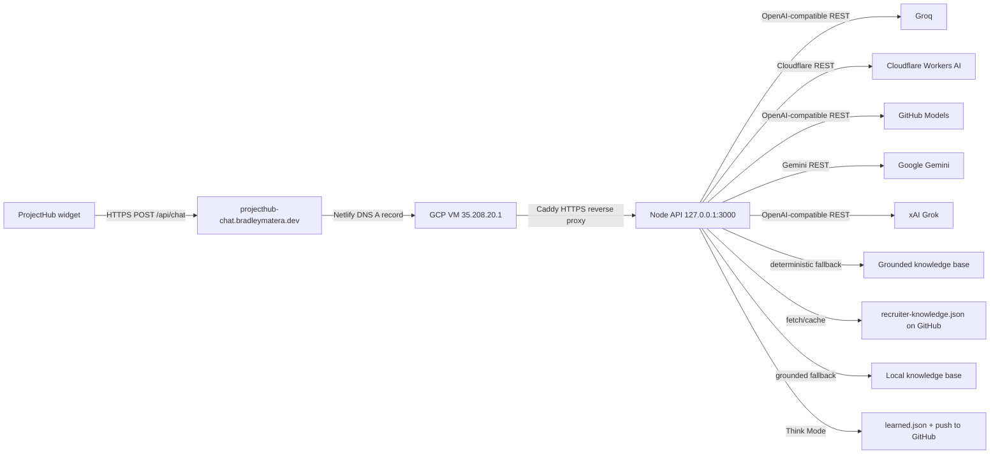

# backend-guide.md

**Read when:** You need to deploy, migrate, or secure the free multi-provider chat backend on Google Cloud.

---

## Goal

Host a **zero-cost** chat API that serves the ProjectHub widget from a Google Cloud free-tier VM. The backend routes open-ended recruiter questions through a priority network of free LLM providers, falling back to a fast, grounded answer from `data/recruiter-knowledge.json` if every provider is unavailable or the reply fails validation.

---

## Always Free Constraints

| Resource | Allowance |
|----------|-----------|
| Compute Engine | 1 `f1-micro` or 1 `e2-micro` instance, up to 720 hours/month |
| Regions | `us-west1`, `us-central1`, `us-east1` |
| Disk | 30 GB standard persistent disk |
| Snapshot | 5 GB |
| Firestore | 1 GiB storage, 50k reads/day, 20k writes/day, 20k deletes/day |
| Same-region egress | Free |

Use an `e2-micro` with standard persistent disk to stay within Always Free.

---

## Architecture



Current production path: Netlify DNS `A` record for `projecthub-chat.bradleymatera.dev` points to the GCP VM external IP `35.208.20.1`. Caddy terminates HTTPS with Let's Encrypt and proxies to the Node API on `127.0.0.1:3000`. The Node API (`server-gemini.js`) always computes a grounded answer first, then routes open-ended questions through the free provider network in priority order. If no provider succeeds or the reply fails validation, the fast, grounded answer is returned.

### Cost ledger (dev-only, env-flagged)

A metering-grade cost tracker lives in `lib/cost-ledger.js` and is enabled with `COST_TRACKER=true`. It records:

- LLM provider token usage (parsed from each API's `usage` field)
- Cloudflare Workers AI neuron estimates
- GCP VM compute seconds and egress bytes
- GitHub API call counts and payload sizes
- Disk writes of state files

All prices are kept in integer **micro-USD** to avoid float drift. The dashboard section is only rendered on `https://bradleymatera.github.io/ProjectHub-dev/` because the endpoint is absent in production.

See `data/free-tier-limits.json` for the authoritative free-tier limits, shadow paid rates, and citation URLs. Update `lastVerified` and re-check provider docs when limits change.

---

## Step-by-Step Deployment

### 1. Create the VM

- Region: `us-west1`, `us-central1`, or `us-east1`
- Machine type: `e2-micro`
- Boot disk: Ubuntu 22.04 LTS, 30 GB standard persistent disk
- Allow HTTP/HTTPS traffic (we will narrow this later)

### 2. Get Free Provider Keys

The backend uses a rotating network of free LLM providers. You need keys for the providers you want to enable. None require payment to get started.

| Provider | Signup / Token source | Model used |
|----------|----------------------|------------|
| Groq | https://console.groq.com/keys | `llama-3.1-8b-instant` |
| Cloudflare Workers AI | https://dash.cloudflare.com/profile/api-tokens | `@cf/meta/llama-3.2-3b-instruct` |
| GitHub Models | GitHub Settings → Developer settings → Personal access tokens → `models:read` | `openai/gpt-4o-mini` |
| Google Gemini | https://aistudio.google.com/app/apikey | `gemini-2.0-flash` |
| xAI Grok | https://console.x.ai/ | `grok-4.3` (optional; free credits can be exhausted quickly) |
| OpenAI-compatible | Any OpenAI-compatible endpoint | configurable (optional) |
| Grounded fallback | `data/recruiter-knowledge.json` hosted on GitHub | Final answer when all providers are unavailable or replies fail validation |

You do **not** need to add billing to any provider to run Scout. The system works as long as at least one provider has remaining free quota.

### 3. Build the Node.js API

The API is in `server-gemini.js`. It is deployed to the VM as `server.js`. Key files:

- `server-gemini.js` — Express server with the free multi-provider LLM router
- `.env` — API keys and configuration
- `recruiter-knowledge.json` — Hosted on GitHub, fetched by the API

Example `.env`:

```env
PORT=3000
KNOWLEDGE_URL=https://raw.githubusercontent.com/BradleyMatera/ProjectHub/master/data/recruiter-knowledge.json
ALLOWED_ORIGINS=https://bradleymatera.dev,https://www.bradleymatera.dev,https://bradleymatera.github.io,https://*.codepen.io

XAI_API_KEY=xai-...
XAI_MODEL=grok-4.3
GROQ_API_KEY=gsk_...
GROQ_MODEL=llama-3.1-8b-instant
GITHUB_MODELS_TOKEN=ghp_...
GITHUB_MODELS_MODEL=openai/gpt-4o-mini
CLOUDFLARE_API_TOKEN=...
CLOUDFLARE_ACCOUNT_ID=...
CLOUDFLARE_MODEL=@cf/meta/llama-3.2-3b-instruct
GEMINI_API_KEY=AIza...
GEMINI_MODEL=gemini-2.0-flash

PROVIDER_ORDER=groq,cloudflare,github,gemini,grok
GEN_MODEL=smollm2:135m
GEN_TIMEOUT_MS=8000

# Optional: OpenAI-compatible provider
OPENAI_API_KEY=...
OPENAI_BASE_URL=https://api.openai.com/v1
OPENAI_MODEL=gpt-4o-mini
OPENAI_DAILY_LIMIT=200

# Think Mode
GITHUB_TOKEN=ghp_...  # Used for both GitHub Models LLM AND knowledge JSON push
```

The server includes:
- CORS configuration for allowed origins (rejects non-allowed origins with `callback(null, false)`)
- Rate limiting (20 requests/minute)
- Knowledge caching (5 minutes)
- Response caching (10 minutes)
- Grounded-first routing with safety and false-claim checks BEFORE learned answers
- Free multi-provider LLM network with daily quota guards and cooldown
- Fast grounded fallback from `data/recruiter-knowledge.json`
- Timeout handling (15 seconds total, 8 seconds per provider)
- Think Mode self-improvement loop (every 10 minutes)
- Safety regex system (injection, XSS, social engineering, secret extraction)
- False-claim regex system (exaggerated claims, buzzwords, tone manipulation)
- `mustStayGrounded` function to force deterministic answers for critical queries
- Out-of-scope question guard (prevents LLM hallucinations on non-recruiter topics)

### 4. Run the API as a Service

Use `systemd` or `pm2` so the proxy starts on boot and restarts on failure.

Example `systemd` service at `/etc/systemd/system/recruiter-chat-api.service`:

```ini
[Unit]
Description=ProjectHub Recruiter Chat API
After=network.target

[Service]
Type=simple
User=ubuntu
WorkingDirectory=/opt/recruiter-chat-api
ExecStart=/usr/bin/node server.js
Restart=always

[Install]
WantedBy=multi-user.target
```

Then:

```bash
sudo systemctl daemon-reload
sudo systemctl enable --now recruiter-chat-api
```

### 5. Secure the Network

- Create a firewall rule allowing inbound TCP 80 and 443 only from your website’s IP ranges or CDN ranges (e.g., GitHub Pages IPs).
- The Node API listens on `127.0.0.1:3000` and is not exposed directly to the internet.
- Caddy handles HTTPS termination and reverse proxy.

### 6. HTTPS with Caddy

Install Caddy on the VM and proxy the public hostname to the private Node API:

```caddyfile
projecthub-chat.bradleymatera.dev {
  reverse_proxy 127.0.0.1:3000
}
```

Caddy obtains and renews the Let's Encrypt certificate automatically. Do not add CORS headers in Caddy; the Express API owns CORS so browsers do not see duplicate `Access-Control-Allow-Origin` values.

### 7. CORS Configuration

The Node API sets CORS with `callback(null, false)` for non-allowed origins (returns response without CORS headers, which browsers block). Caddy should not add CORS headers. Keep `https://bradleymatera.github.io`, `https://bradleymatera.dev`, and `https://www.bradleymatera.dev` in `ALLOWED_ORIGINS`; include `https://*.codepen.io` only when CodePen embedding needs to call the API.

### 8. Static IP and DNS

- Keep the VM external IP attached while the service is public.
- Netlify DNS should have an `A` record for `projecthub-chat.bradleymatera.dev` pointing to `35.208.20.1`.
- Update the widget fallback URL in `logic.js` to `https://projecthub-chat.bradleymatera.dev/api/chat`.

### 9. Frontend Integration

In `logic.js`, replace the fallback URL:

```javascript
const res = await fetch("https://projecthub-chat.bradleymatera.dev/api/chat", {
  method: "POST",
  headers: { "Content-Type": "application/json" },
  body: JSON.stringify({ message: userQuery })
});
```

### 10. Optional: Firestore Chat History

- Enable Firestore in Native mode.
- Use the Firebase Admin SDK in the proxy to write messages to a `messages` collection.
- Stay under the free daily quotas.

---

## Monitoring

- Watch CPU and memory in the Google Cloud console.
- Call `GET https://projecthub-chat.bradleymatera.dev/health` to see provider order, enabled status, daily quota usage, and cooldown state.
- Monitor each provider's free-tier dashboard:
  - Groq: https://console.groq.com/
  - Cloudflare: https://dash.cloudflare.com/
  - GitHub Models: https://github.com/settings/tokens
  - Google Gemini: https://aistudio.google.com/app/apikey
- Keep traffic within the same region to avoid egress charges.
- Rotate API keys periodically.

---

## Cost Checklist

- [ ] `e2-micro` in an Always Free region
- [ ] 30 GB standard persistent disk
- [ ] Static regional IP attached to running VM
- [ ] Same-region traffic only
- [ ] HTTPS certificate free (Let's Encrypt via Caddy)
- [ ] All LLM calls use free-tier providers; grounded fallback requires no LLM credits
- [ ] Provider quota/cooldown guards enabled (`PROVIDER_ORDER` and daily limits set)
- [ ] No paid AI subscriptions required to keep Scout online
