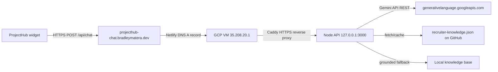

# backend-guide.md

**Read when:** You need to deploy, migrate, or secure the Gemini API chat backend on Google Cloud.

---

## Goal

Host a Gemini API-backed chat API that serves the ProjectHub widget from a free Google Cloud micro VM, replacing the current Heroku proxy.

---

## Always Free Constraints

| Resource | Allowance |
|----------|-----------|
| Compute Engine | 1 `f1-micro` or 1 `e2-micro` instance, up to 720 hours/month |
| Regions | `us-west1`, `us-central1`, `us-east1` |
| Disk | 30 GB standard persistent disk |
| Snapshot | 5 GB |
| Firestore | 1 GiB storage, 50k reads/day, 20k writes/day, 20k deletes/day |
| Same-region egress | Free |

Use an `e2-micro` with standard persistent disk to stay within Always Free.

---

## Architecture



Current production path: Netlify DNS `A` record for `projecthub-chat.bradleymatera.dev` points to the GCP VM external IP `35.208.20.1`. Caddy terminates HTTPS with Let's Encrypt and proxies to the Node API on `127.0.0.1:3000`. The Node API calls Gemini's REST API for generation, with grounded fallback to local knowledge base when credits are depleted.

---

## Step-by-Step Deployment

### 1. Create the VM

- Region: `us-west1`, `us-central1`, or `us-east1`
- Machine type: `e2-micro`
- Boot disk: Ubuntu 22.04 LTS, 30 GB standard persistent disk
- Allow HTTP/HTTPS traffic (we will narrow this later)

### 2. Get Gemini API Key

1. Go to https://aistudio.google.com/app/apikey
2. Sign in with your Google account
3. Click "Create API key"
4. Copy the key (starts with `AIza...`)
5. Add prepaid credits or enable billing for the project at https://ai.studio/projects

**Free tier:** Gemini API has free tier access for eligible models (~15 requests/minute), but requires prepaid credits or billing for sustained usage.

### 3. Build the Node.js API

The API uses Gemini's REST API with grounded fallback to local knowledge base. Key files:

- `server.js` - Express server with Gemini integration
- `.env` - API key and configuration
- `recruiter-knowledge.json` - Hosted on GitHub, fetched by the API

Example `.env`:

```env
PORT=3000
GEMINI_API_KEY=AIza...
GEMINI_MODEL=gemini-2.0-flash
KNOWLEDGE_URL=https://raw.githubusercontent.com/BradleyMatera/ProjectHub/master/data/recruiter-knowledge.json
ALLOWED_ORIGINS=https://bradleymatera.dev,https://www.bradleymatera.dev,https://bradleymatera.github.io,https://*.codepen.io
```

The server includes:
- CORS configuration for allowed origins
- Rate limiting (20 requests/minute)
- Knowledge caching (5 minutes)
- Response caching (10 minutes)
- Grounded fallback when Gemini credits are depleted
- Timeout handling (15 seconds)

### 4. Run the API as a Service

Use `systemd` or `pm2` so the proxy starts on boot and restarts on failure.

Example `systemd` service at `/etc/systemd/system/recruiter-chat-api.service`:

```ini
[Unit]
Description=ProjectHub Recruiter Chat API
After=network.target

[Service]
Type=simple
User=ubuntu
WorkingDirectory=/opt/recruiter-chat-api
ExecStart=/usr/bin/node server.js
Restart=always

[Install]
WantedBy=multi-user.target
```

Then:

```bash
sudo systemctl daemon-reload
sudo systemctl enable --now recruiter-chat-api
```

### 5. Secure the Network

- Create a firewall rule allowing inbound TCP 80 and 443 only from your website’s IP ranges or CDN ranges (e.g., GitHub Pages IPs).
- The Node API listens on `127.0.0.1:3000` and is not exposed directly to the internet.
- Caddy handles HTTPS termination and reverse proxy.

### 6. HTTPS with Caddy

Install Caddy on the VM and proxy the public hostname to the private Node API:

```caddyfile
projecthub-chat.bradleymatera.dev {
  reverse_proxy 127.0.0.1:3000
}
```

Caddy obtains and renews the Let's Encrypt certificate automatically. Do not add CORS headers in Caddy; the Express API owns CORS so browsers do not see duplicate `Access-Control-Allow-Origin` values.

### 7. CORS Configuration

The Node API sets CORS. Caddy should not add CORS headers. Keep `https://bradleymatera.github.io`, `https://bradleymatera.dev`, and `https://www.bradleymatera.dev` in `ALLOWED_ORIGINS`; include `https://*.codepen.io` only when CodePen embedding needs to call the API.

### 8. Static IP and DNS

- Keep the VM external IP attached while the service is public.
- Netlify DNS should have an `A` record for `projecthub-chat.bradleymatera.dev` pointing to `35.208.20.1`.
- Update the widget fallback URL in `logic.js` to `https://projecthub-chat.bradleymatera.dev/api/chat`.

### 9. Frontend Integration

In `logic.js`, replace the fallback URL:

```javascript
const res = await fetch("https://projecthub-chat.bradleymatera.dev/api/chat", {
  method: "POST",
  headers: { "Content-Type": "application/json" },
  body: JSON.stringify({ message: userQuery })
});
```

### 10. Optional: Firestore Chat History

- Enable Firestore in Native mode.
- Use the Firebase Admin SDK in the proxy to write messages to a `messages` collection.
- Stay under the free daily quotas.

---

## Monitoring

- Watch CPU and memory in the Google Cloud console.
- Monitor Gemini API usage at https://ai.studio/projects
- Check prepaid credit balance and refill when depleted
- Keep traffic within the same region to avoid egress charges.
- Rotate API keys periodically.

---

## Cost Checklist

- [ ] `e2-micro` in an Always Free region
- [ ] 30 GB standard persistent disk
- [ ] Static regional IP attached to running VM
- [ ] Same-region traffic only
- [ ] Firestore within daily free quotas (if used)
- [ ] HTTPS certificate free (Let's Encrypt via Caddy)
- [ ] Gemini API prepaid credits or billing enabled at https://ai.studio/projects
- [ ] Monitor Gemini API usage to stay within free tier or prepaid limits
