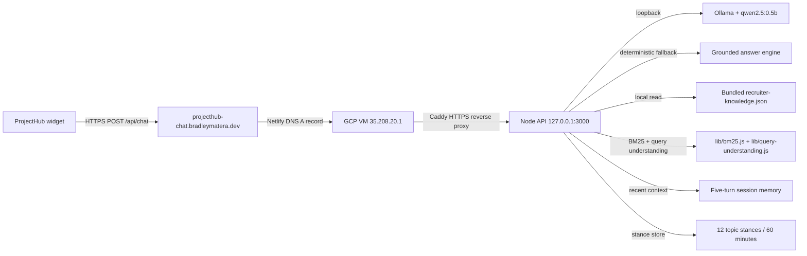

# backend-guide.md

**Read when:** You need to deploy, migrate, or secure the local-only Ollama chat backend on Google Cloud.

---

## Goal

Host a **zero-cost** chat API on a Google Cloud free-tier VM. The same VM runs Node, loopback-only Ollama, `qwen2.5:0.5b`, local BM25 retrieval, and a deterministic grounded fallback.

---

## Always Free Constraints

| Resource | Allowance |
|----------|-----------|
| Compute Engine | 1 `f1-micro` or 1 `e2-micro` instance, up to 720 hours/month |
| Regions | `us-west1`, `us-central1`, `us-east1` |
| Disk | 30 GB standard persistent disk |
| Snapshot | 5 GB |
| Firestore | 1 GiB storage, 50k reads/day, 20k writes/day, 20k deletes/day |
| Same-region egress | Free |

Use an `e2-micro` with standard persistent disk to stay within Always Free.

---

## Architecture


```mermaid
flowchart LR
  A[ProjectHub widget] -- HTTPS POST /api/chat --> B[projecthub-chat.bradleymatera.dev]
  B -- Netlify DNS A record --> C[GCP VM 35.208.20.1]
  C -- Caddy HTTPS reverse proxy --> D[Node API 127.0.0.1:3000]
  D -- loopback --> E1[Ollama + qwen2.5:0.5b]
  D -- deterministic fallback --> E5[Grounded answer engine]
  D -- local read --> G[Bundled recruiter-knowledge.json]
  D -- BM25 + query understanding --> I[lib/bm25.js + lib/query-understanding.js]
  D -- recent context --> M[Five-turn session memory]
  D -- stance store --> L[12 topic stances / 60 minutes]
```

Current production path: Netlify DNS points `projecthub-chat.bradleymatera.dev` to the GCP VM. Caddy terminates HTTPS and proxies to Node on loopback. Node computes a grounded answer first, then permits bounded local Qwen generation for open-ended questions. If the 15-second budget or validation fails, the grounded answer is returned.

### Cost ledger (env-flagged, enabled on dev and prod)

A metering-grade cost tracker lives in `lib/cost-ledger.js` and is enabled with `COST_TRACKER=true` on both the dev and production VMs. It records:

- Local Ollama token usage
- GCP VM compute seconds and egress bytes
- GitHub API call counts and payload sizes
- Disk writes of state files

All prices are kept in integer **micro-USD** to avoid float drift. The analytics dashboard (including the Cost & Free-Tier section) renders on both the production and staging Pages sites; each site fetches its matching backend's `/api/costs`.

See `data/free-tier-limits.json` for metering metadata and legacy provider retirement notes.

---

## Step-by-Step Deployment

### 1. Create the VM

- Region: `us-west1`, `us-central1`, or `us-east1`
- Machine type: `e2-micro`
- Boot disk: Ubuntu 22.04 LTS, 30 GB standard persistent disk
- Allow HTTP/HTTPS traffic (we will narrow this later)

### 2. Install and Pre-warm Ollama

No AI provider keys are required. Run `bash scripts/setup-ollama-preview.sh` for the private preview VM, or apply the equivalent loopback-only service settings in production. The script installs bounded swap, pulls `qwen2.5:0.5b`, fixes the context at 1536, restricts parallelism to one, and pre-warms the model.

### 3. Build the Node.js API

The API is in `server-gemini.js`. It is deployed to the VM as `server.js`. Key files:

- `server-gemini.js` — Express server with local Ollama conversation and deterministic fallback
- `lib/rag-chunks.js` — Shared RAG chunk builder (flattens knowledge JSON into retrievable chunks)
- `lib/bm25.js` — Okapi BM25 retrieval index (TF saturation, IDF, length normalization)
- `lib/query-understanding.js` — Query normalization, typo correction, intent classification, contextual rewriting
- `lib/local-conversation.js` — five-turn memory builder and strict local reply validator
- `lib/cost-ledger.js` — Metering tracker for every billable-adjacent event
- `.env` — local runtime configuration
- `data/recruiter-knowledge.json` — bundled knowledge read by the API

Example `.env`:

```env
PORT=3000
LOCAL_ONLY_MODE=true
KNOWLEDGE_FILE=data/recruiter-knowledge.json
ALLOWED_ORIGINS=https://bradleymatera.dev,https://www.bradleymatera.dev,https://bradleymatera.github.io,https://*.codepen.io
PROVIDER_ORDER=
GROQ_ENABLED=false
AGENT_GROQ_ENABLED=false
OLLAMA_URL=http://127.0.0.1:11434
OLLAMA_AGENT_ENABLED=true
OLLAMA_AGENT_MODEL=qwen2.5:0.5b
OLLAMA_AGENT_CONTEXT=1536
OLLAMA_AGENT_KEEP_ALIVE=-1
GEN_MODEL=qwen2.5:0.5b
GEN_TIMEOUT_MS=15000

# Retrieval pipeline
USE_BM25_RETRIEVAL=true
USE_VECTOR_RETRIEVAL=false
THINK_PUSH_ENABLED=false
```

The server includes:
- CORS configuration for allowed origins (rejects non-allowed origins with `callback(null, false)`)
- Rate limiting (20 requests/minute)
- Knowledge caching (15 minutes)
- Response caching (30 minutes)
- Grounded-first routing with safety and false-claim checks BEFORE learned answers
- Local Qwen conversation through loopback-only Ollama
- Fast grounded fallback from `data/recruiter-knowledge.json`
- Timeout handling (15 seconds for local generation)
- Local Think Mode analysis with remote pushes disabled
- Safety regex system (injection, XSS, social engineering, secret extraction)
- False-claim regex system (exaggerated claims, buzzwords, tone manipulation)
- `mustStayGrounded` function to force deterministic answers for critical queries
- Out-of-scope question guard (prevents LLM hallucinations on non-recruiter topics)
- BM25 retrieval index with query understanding (typo correction, intent classification, contextual rewriting)
- Five-turn memory and a 12-topic, 60-minute stance store
- Source/entity/number/overclaim validation for every local generation

### 4. Run the API as a Service

Use `systemd` or `pm2` so the proxy starts on boot and restarts on failure.

Example `systemd` service at `/etc/systemd/system/recruiter-chat-api.service`:

```ini
[Unit]
Description=ProjectHub Recruiter Chat API
After=network.target

[Service]
Type=simple
User=ubuntu
WorkingDirectory=/opt/recruiter-chat-api
ExecStart=/usr/bin/node server.js
Restart=always

[Install]
WantedBy=multi-user.target
```

Then:

```bash
sudo systemctl daemon-reload
sudo systemctl enable --now recruiter-chat-api
```

### 5. Secure the Network

- Create a firewall rule allowing inbound TCP 80 and 443 only from your website’s IP ranges or CDN ranges (e.g., GitHub Pages IPs).
- The Node API listens on `127.0.0.1:3000` and is not exposed directly to the internet.
- Caddy handles HTTPS termination and reverse proxy.

### 6. HTTPS with Caddy

Install Caddy on the VM and proxy the public hostname to the private Node API:

```caddyfile
projecthub-chat.bradleymatera.dev {
  reverse_proxy 127.0.0.1:3000
}
```

Caddy obtains and renews the Let's Encrypt certificate automatically. Do not add CORS headers in Caddy; the Express API owns CORS so browsers do not see duplicate `Access-Control-Allow-Origin` values.

### 7. CORS Configuration

The Node API sets CORS with `callback(null, false)` for non-allowed origins (returns response without CORS headers, which browsers block). Caddy should not add CORS headers. Keep `https://bradleymatera.github.io`, `https://bradleymatera.dev`, and `https://www.bradleymatera.dev` in `ALLOWED_ORIGINS`; include `https://*.codepen.io` only when CodePen embedding needs to call the API.

### 8. Static IP and DNS

- Keep the VM external IP attached while the service is public.
- Netlify DNS should have an `A` record for `projecthub-chat.bradleymatera.dev` pointing to `35.208.20.1`.
- Update the widget fallback URL in `logic.js` to `https://projecthub-chat.bradleymatera.dev/api/chat`.

### 9. Frontend Integration

In `logic.js`, replace the fallback URL:

```javascript
const res = await fetch("https://projecthub-chat.bradleymatera.dev/api/chat", {
  method: "POST",
  headers: { "Content-Type": "application/json" },
  body: JSON.stringify({ message: userQuery })
});
```

### 10. Optional: Firestore Chat History

- Enable Firestore in Native mode.
- Use the Firebase Admin SDK in the proxy to write messages to a `messages` collection.
- Stay under the free daily quotas.

---

## Monitoring

- Watch CPU and memory in the Google Cloud console.
- Call `GET https://projecthub-chat.bradleymatera.dev/health` to verify `localOnly`, the empty provider order, Qwen model, BM25 mode, memory settings, and Ollama status.
- Debug retrieval: `curl 'https://dev.projecthub-chat.bradleymatera.dev/api/retrieve?q=what+is+his+tech+stack'`
- Monitor VM CPU, memory, swap, disk, `ollama ps`, and the Node service journal.
- Keep traffic within the same region to avoid egress charges.

---

## Cost Checklist

- [ ] `e2-micro` in an Always Free region
- [ ] 30 GB standard persistent disk
- [ ] Static regional IP attached to running VM
- [ ] Same-region traffic only
- [ ] HTTPS certificate free (Let's Encrypt via Caddy)
- [ ] `LOCAL_ONLY_MODE=true`, `PROVIDER_ORDER=` and `USE_VECTOR_RETRIEVAL=false`
- [ ] Ollama listens only on `127.0.0.1:11434`
- [ ] `qwen2.5:0.5b` is pre-warmed at context 1536 and kept loaded
- [ ] No AI provider key or paid subscription is required
- [ ] Bundled `data/recruiter-knowledge.json` is deployed beside the server
- [ ] `lib/` directory synced to VM by deploy script
