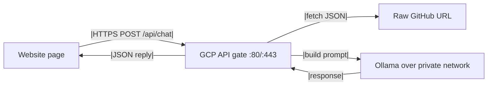
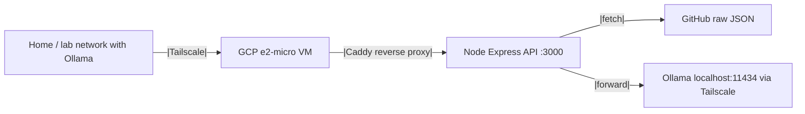

# google-cloud-chat-api.md

**Read when:** You need to understand how the GCP-hosted chat API fetches ProjectHub knowledge and forwards requests to Ollama.

---

## Overview

The chatbot is powered by a **single knowledge file** stored in this GitHub repository and a lightweight **GCP API gate** that forwards user messages to an Ollama model.



- The knowledge file is public and safe to read from GitHub.
- Ollama is **not exposed to the internet** directly.
- All websites under `bradleymatera.dev` can share the same API and the same knowledge source.

---

## Knowledge File

- **Path in repo:** `data/recruiter-knowledge.json`
- **Raw URL:** `https://raw.githubusercontent.com/BradleyMatera/ProjectHub/master/data/recruiter-knowledge.json`
- **Format:** Valid JSON containing identity, summary, goals, education, certifications, skills, experience, projects, rules, interview stories, FAQ, and site metadata.
- **Contents:** Public, recruiter-friendly facts about Bradley Matera. No secrets, no personal documents, no private reference info.

### How to update the bot's knowledge

1. Edit `data/recruiter-knowledge.json` in this repo.
2. Commit and push to `master`.
3. The GCP API will fetch the latest version on the next request (or refresh interval if implemented).

---

## GCP API Gate

The API gate is a small Node.js/Express app running behind Caddy on a GCP `e2-micro` VM.

### Repository location on the VM

```text
/opt/recruiter-chat-api/
```

### Environment variables

| Variable | Purpose | Example |
|----------|---------|---------|
| `PORT` | Port the Express app listens on | `3000` |
| `ALLOWED_ORIGIN` | Primary CORS-allowed origin | `https://bradleymatera.dev` |
| `OLLAMA_BASE_URL` | Private URL to the Ollama instance | `http://100.x.x.x:11434` (Tailscale) |
| `OLLAMA_MODEL` | Model name to use | `qwen2.5-coder:14b` |
| `KNOWLEDGE_URL` | Raw GitHub URL for the JSON knowledge file | `https://raw.githubusercontent.com/BradleyMatera/ProjectHub/master/data/recruiter-knowledge.json` |

### Suggested API behavior

1. Accept `POST /api/chat` with JSON body `{ "message": "..." }`.
2. Enforce CORS against allowed origins.
3. Fetch `recruiter-knowledge.json` from the raw GitHub URL.
4. Build a system prompt from:
   - `identity.shortPitch`
   - `rules.do` and `rules.doNot`
   - relevant experience, skills, and projects
   - FAQ entries when the question matches
5. POST the combined prompt to `${OLLAMA_BASE_URL}/v1/chat/completions`.
6. Return `{ "reply": "..." }` to the client.

### Simplified prompt template

```text
You are Bradley Matera, a junior software engineer. Answer as yourself in a direct, honest, and simple way. Do not oversell. Do not claim experience you do not have.

Use the following facts:
- Name: {name}
- Location: {location}
- Summary: {summary}
- Top skills: {skills}
- Target roles: {targetRoles}

Relevant experience:
{matchedExperience}

Relevant projects:
{matchedProjects}

Rules:
{rules}

User question: {message}
```

### Endpoint contract

- **URL:** `https://chat.bradleymatera.dev/api/chat` (or the VM's public IP/hostname)
- **Method:** `POST`
- **Headers:** `Content-Type: application/json`
- **Body:**
  ```json
  {
    "message": "Who is Bradley Matera?"
  }
  ```
- **Response:**
  ```json
  {
    "reply": "Bradley Matera is a junior software engineer..."
  }
  ```

---

## Network Architecture



- GCP firewall only allows inbound `tcp:80` and `tcp:443` from `0.0.0.0/0`.
- The Express app rejects requests from disallowed origins via CORS.
- Ollama is reachable only through the private Tailscale network.
- No cloud secrets are stored in the repo; only the public JSON knowledge file.

---

## Important Rules

- **Do not store secrets in the JSON knowledge file.** It is public.
- **Do not expose the Ollama port publicly.** Use Tailscale or another private network path.
- **Restrict allowed origins in the API.** Only accept requests from `bradleymatera.dev` and known subdomains.
- **Keep responses honest and junior-level.** The `rules.doNot` section in the JSON must be respected by the prompt.
- **Use HTTPS for the public endpoint.** Caddy can provision a Let's Encrypt certificate automatically when a public domain is pointed at the VM.

---

## Current Status

- GCP `e2-micro` VM: `ollama-api-gate` in `us-central1-a`
- Node API: running on port `3000` via `systemd`
- Caddy: reverse proxying `:80` to `127.0.0.1:3000`
- Tailscale: installed on the VM, awaiting connection to the home Ollama host
- Ollama backend: not yet connected

Next step is to set `OLLAMA_BASE_URL` to the Tailscale IP of the home/lab Ollama machine and restart the API service.

---

## Suggested Client-Side Integration

In ProjectHub `logic.js`, replace the Heroku fallback with a call to the GCP API:

```javascript
const res = await fetch("https://chat.bradleymatera.dev/api/chat", {
  method: "POST",
  headers: { "Content-Type": "application/json" },
  body: JSON.stringify({ message: userQuery })
});
const data = await res.json();
reply = data.reply || "I couldn't get a response from the AI backend.";
```

For local testing, the public IP and `/api/chat` path also work as long as the firewall rule allows the request.
