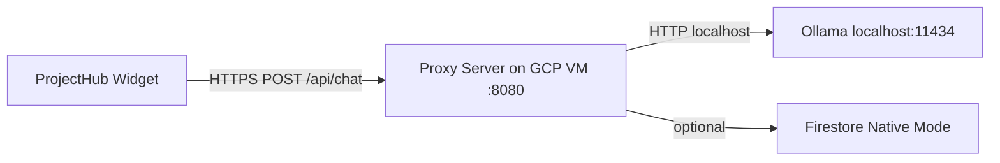

# Zero-Cost Ollama Chat Backend Plan

**Read when:** You want the full strategic plan for migrating the ProjectHub AI fallback from the paid Heroku proxy to a free Ollama backend on Google Cloud.

---

## 1. Understand the Google Cloud “Always Free” Limits

### Compute Engine
- One `f1-micro` **or** one `e2-micro` instance free for up to **720 hours per month**.
- Only available in specific regions: `us-west1`, `us-central1`, `us-east1`.
- Must use an **`e2-micro`** machine type with a **standard persistent disk** to stay free.

### Storage & Networking
- **30 GB** standard persistent disk included.
- **5 GB** snapshot storage included.
- Same-region egress is **free**; cross-region egress is metered.

### Firestore
- Free tier covers:
  - **1 GiB** storage
  - **50,000 reads/day**
  - **20,000 writes/day**
  - **20,000 deletes/day**
- More than enough for a simple personal chatbot and chat history.

---

## 2. Planned Architecture



### Components

1. **Compute Instance**
   - Create a Compute Engine `e2-micro` VM in `us-west1`, `us-central1`, or `us-east1`.
   - Use Ubuntu 22.04 LTS or another lightweight Linux image.

2. **Install Ollama**
   ```bash
   curl -fsSL https://ollama.com/install.sh | sh
   sudo systemctl enable --now ollama
   ```
   - Ollama daemon listens on `localhost:11434`.

3. **Load a Model**
   - Pull a compact model that fits the micro VM’s ~1 GiB RAM.
   - Avoid `gpt-oss:20b`; use lightweight quantizations such as:
     - `mistral:7b-instruct-q4_K_M`
     - `phi3:mini`
     - `llama3.2:1b`

4. **Proxy API Server**
   - Small Node.js/Express or Python/Flask server listening on port **8080**.
   - Forwards chat requests to `http://localhost:11434/v1/chat/completions`.
   - Minimal Express example:
     ```javascript
     const express = require('express');
     const fetch = require('node-fetch');
     const app = express();

     app.use(express.json());

     app.post('/api/chat', async (req, res) => {
       const ollamaRes = await fetch('http://localhost:11434/v1/chat/completions', {
         method: 'POST',
         headers: { 'Content-Type': 'application/json' },
         body: JSON.stringify({
           model: 'mistral:7b-instruct-q4_K_M',
           messages: [{ role: 'user', content: req.body.message }]
         })
       });
       const data = await ollamaRes.json();
       res.json({ reply: data.choices?.[0]?.message?.content || 'No response' });
     });

     app.listen(8080);
     ```

5. **Secure the Endpoint**
   - **Firewall rules**: Allow inbound traffic on port 8080 only from your website’s IP ranges. Deny all other sources.
   - **CORS & API keys**: In the proxy, restrict `Access-Control-Allow-Origin` to your domain (e.g., `https://bradleymatera.github.io`) and require an API key header.
   - **HTTPS**: Use a free managed certificate with Google Cloud HTTPS Load Balancer, or a self-hosted Let’s Encrypt certificate.

6. **Persistent Storage (Optional)**
   - Enable Firestore in Native mode.
   - Use the Firebase Admin SDK in the proxy to write chat messages to a `messages` collection.
   - Keep usage within the free daily quotas.

---

## 3. Deploy and Configure

1. **Start the Proxy on Boot**
   - Use `systemd` or `pm2` to run the proxy as a service so it restarts automatically.
   - Example `systemd` service:
     ```ini
     [Unit]
     Description=ProjectHub Ollama Proxy
     After=network.target

     [Service]
     Type=simple
     User=ubuntu
   WorkingDirectory=/opt/recruiter-chat-api
     ExecStart=/usr/bin/node server.js
     Environment=PROJECTHUB_API_KEY=your-secret-key
     Restart=always

     [Install]
     WantedBy=multi-user.target
     ```

2. **Reserve a Static External IP**
   - Assign a static regional IP to the VM so DNS can point at it.
   - Static regional IPs are free while attached to a running VM.

3. **DNS Configuration**
   - Create an A-record such as `projecthub-chat.bradleymatera.dev` pointing to the static IP.
   - Update `logic.js` to call `https://projecthub-chat.bradleymatera.dev/api/chat`.

4. **Frontend Integration**
   - Modify the ProjectHub widget to POST to the new `/api/chat` endpoint.
   - Include the API key in the request headers.
   - Add a spinner or loading message while waiting for the response.

---

## 4. Monitor and Optimize

- **Resource usage**: Watch CPU and memory in the Google Cloud console. If the model is too heavy, switch to a smaller quantization (`Q4_K_M` or `Q3_K_M`) or a less resource-intensive model.
- **Networking costs**: Keep traffic within the free region. Serving only your own site will use minimal egress and should remain within Always Free limits.
- **Security**:
  - Do not expose the Ollama port (`11434`) to the internet.
  - Use service accounts and secrets to access Firestore.
  - Rotate API keys regularly.

---

## Summary

By following this plan, you can host a simple Ollama-backed chat API for ProjectHub on a Google Cloud `e2-micro` VM without incurring charges. Stay within Always Free regions and quotas, use a lightweight quantized model, restrict network access with firewall rules and CORS, and integrate the new HTTPS `/api/chat` endpoint into the ProjectHub widget.
